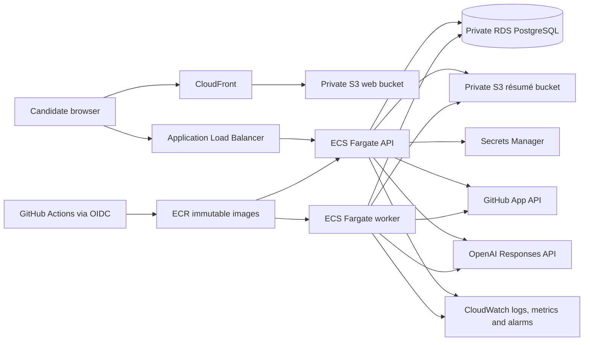

# Production architecture

The browser uses secure cookies and CSRF tokens. Résumés stay in a private bucket. The worker consumes durable PostgreSQL jobs, so API restarts do not lose analysis work. Production secrets are injected at runtime and never committed. OpenTelemetry instrumentation can export traces and metrics through an approved OTLP collector; CloudWatch container insights, structured logs, health checks, and a 5xx alarm form the baseline.

The supplied application stack accepts existing network, database, bucket, secret, and narrowly scoped IAM role identifiers. This separation prevents a repository workflow from creating its own administrator role.
